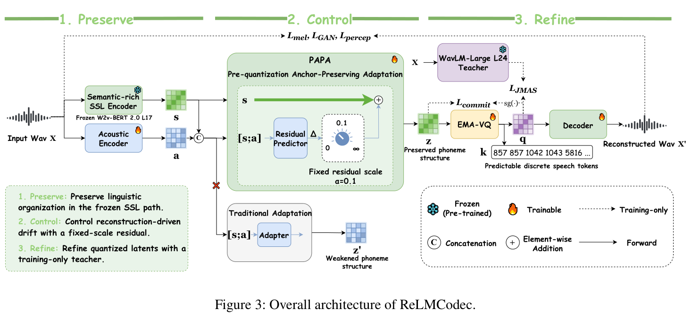
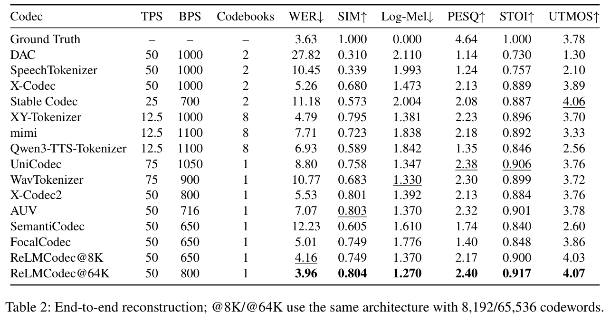

<div align="center">

# ReLMCodec: Designing Predictable Speech Tokens from Pre-Quantization Phoneme Structure

[](https://arxiv.org/abs/2608.08286)
[](https://huggingface.co/hf-wzx1205/ReLMCodec)
[](https://modelscope.cn/models/wanzixiang/ReLMCodec)
[](LICENSE)

[Paper](https://arxiv.org/abs/2608.08286) · [Weights](#checkpoints) · [Quick start](#quick-start) · [Evaluation](docs/EVALUATION.md) · [Verified results](docs/RESULTS.md)

</div>

ReLMCodec is a **16 kHz, single-stream speech codec** designed for both waveform reconstruction and autoregressive token modeling. It emits 50 tokens/s at **650 bps (8K)** or **800 bps (64K)**. The released inference checkpoints include the frozen W2v-BERT 2.0 frontend, so no separate model download is needed.

## From the paper

Across 24 representations tested with the same probing quantizer and language model, pre-quantization phoneme separability correlates strongly with next-token accuracy (**Spearman ρ = 0.911**). ReLMCodec turns that observation into a *preserve → control → refine* design:

- **Preserve** phoneme structure with frozen W2v-BERT 2.0 features.
- **Control** reconstruction-driven drift with PAPA's small acoustic residual.
- **Refine** quantized latents during training with a WavLM-Large L24 teacher, which is absent at inference.

<p align="center"></p>

**Paper reconstruction results.** Table 2 compares end-to-end systems on LibriSpeech test-clean + test-other. In the paper, ReLMCodec@64K reaches **3.96 WER**, **0.804 speaker similarity**, and **2.40 PESQ** at 800 bps with one codebook. The paper also reports downstream TTS gains in intelligibility and speaker similarity; those TTS models are outside this inference release.

<p align="center"></p>

The images above are cropped from the [paper PDF](https://arxiv.org/pdf/2608.08286). They show **paper results**; measurements from the downloadable checkpoints, including the available 64K fine-tune, are recorded separately in [Verified results](docs/RESULTS.md).

## Checkpoints

| Model | Codebook | Rate | Download |
| :--- | ---: | ---: | :--- |
| **ReLMCodec@8K** | 8,192 | 650 bps | [Hugging Face](https://huggingface.co/hf-wzx1205/ReLMCodec/blob/main/models/relmcodec_8k.pt) · [ModelScope](https://modelscope.cn/models/wanzixiang/ReLMCodec) |
| **ReLMCodec@64K** | 65,536 | 800 bps | [Hugging Face](https://huggingface.co/hf-wzx1205/ReLMCodec/blob/main/models/relmcodec_64k.pt) · [ModelScope](https://modelscope.cn/models/wanzixiang/ReLMCodec) |

Each ~3.1 GB file contains inference weights only, with no optimizer or training state. The 8K checkpoint comes from the 200K perceptual stage; the released 64K checkpoint is the best available retained fine-tune, selected on a separate dev set. See [checkpoint provenance](docs/CHECKPOINTS.md) for hashes and the distinction from the paper's 64K table.

## Quick start

Use Python **3.10 or 3.11** on Linux. Install a [PyTorch build](https://pytorch.org/get-started/locally/) matching your machine if CUDA 12.8 is unavailable.

```bash
python -m venv .venv && source .venv/bin/activate
python -m pip install torch==2.9.0 torchaudio==2.9.0 \
  --index-url https://download.pytorch.org/whl/cu128
python -m pip install -e '.[hub-hf]'
python scripts/download_weights.py --source hf --variant 64k
export USE_TF=0
python scripts/smoke_test.py --variant 64k

python infer.py reconstruct \
  --config configs/relmcodec_64k.yaml \
  --checkpoint models/relmcodec_64k.pt \
  --input input.wav --output reconstructed.wav
```

For ModelScope, install `.[hub-ms]` and pass `--source modelscope`. Use `--variant 8k` for the 8K model. The download helper checks SHA-256 before using a file. See [Inference](docs/INFERENCE.md) for token `encode`/`decode` commands and audio details.

## Reproduce reconstruction metrics

```bash
python -m pip install -e '.[eval]'
python scripts/prepare_librispeech_eval.py \
  --root /datasets/LibriSpeech --output-dir data/filelists
python evaluate.py \
  --config configs/relmcodec_64k.yaml \
  --checkpoint models/relmcodec_64k.pt \
  --filelist data/filelists/test-all.txt \
  --output-dir outputs/64k/reconstructions \
  --result-json outputs/64k/metrics.json
```

This computes Log-Mel, wide-band PESQ, and STOI for LibriSpeech test-clean + test-other. [Evaluation](docs/EVALUATION.md) documents the external WER, speaker-similarity, and UTMOS evaluators; [Verified results](docs/RESULTS.md) contains the complete fresh reconstruction run and per-file data. The P-VQ probes and downstream TTS systems in the paper require separately trained models.

## Citation

```bibtex
@misc{wan2026relmcodec,
  title         = {ReLMCodec: Designing Predictable Speech Tokens from Pre-Quantization Phoneme Structure},
  author        = {Zixiang Wan and Xusheng Yang and Zheng Wang and Peiji Yang},
  year          = {2026},
  eprint        = {2608.08286},
  archivePrefix = {arXiv},
  primaryClass  = {eess.AS},
  url           = {https://arxiv.org/abs/2608.08286}
}
```

Code is [MIT licensed](LICENSE). See [third-party notices](THIRD_PARTY_NOTICES.md) for embedded W2v-BERT parameters and vendored components.
