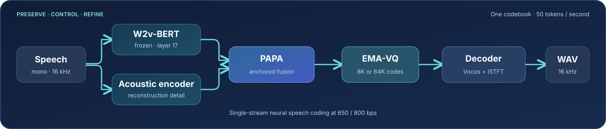

<div align="center">

# ReLMCodec

**Predictable speech tokens from a single 50 Hz code stream**

[](https://arxiv.org/abs/2608.08286)
[](https://huggingface.co/hf-wzx1205/ReLMCodec)
[](https://modelscope.cn/models/wanzixiang/ReLMCodec)
[](LICENSE)

[Paper](https://arxiv.org/abs/2608.08286) · [Weights on Hugging Face](https://huggingface.co/hf-wzx1205/ReLMCodec) · [Weights on ModelScope](https://modelscope.cn/models/wanzixiang/ReLMCodec) · [Reproduction results](docs/RESULTS.md)

</div>



ReLMCodec is a **16 kHz speech codec** with one discrete token stream. Its quantizer emits **50 tokens per second** from an 8K or 64K codebook, corresponding to nominal rates of **650 or 800 bps**. This repository packages inference, encode/decode tools, and the protocol for the paper's *speech reconstruction* metrics. Both inference checkpoints include the frozen W2v-BERT 2.0 frontend; no separate encoder download is needed.

## At a glance

| Variant | Codewords | Rate | Released checkpoint | Weight file |
| :--- | ---: | ---: | :--- | :--- |
| **ReLMCodec@8K** | 8,192 | 650 bps | 200K perceptual stage | [HF](https://huggingface.co/hf-wzx1205/ReLMCodec/blob/main/models/relmcodec_8k.pt) · [MS](https://modelscope.cn/models/wanzixiang/ReLMCodec) |
| **ReLMCodec@64K** | 65,536 | 800 bps | 50K additional fine-tune, selected on dev speech | [HF](https://huggingface.co/hf-wzx1205/ReLMCodec/blob/main/models/relmcodec_64k.pt) · [MS](https://modelscope.cn/models/wanzixiang/ReLMCodec) |

The downloadable files are **inference-only** PyTorch state dictionaries, each about 3.1 GB. They contain no optimizer, scheduler, discriminator, or RNG state. Their SHA-256 hashes and conversion checks are in [Checkpoint provenance](docs/CHECKPOINTS.md). Each checkpoint already contains its frozen W2v-BERT frontend; the download helper places it under `models/` for the CLI.

### Full LibriSpeech test-set reconstruction

We reran the bundled weights on **all 5,559** test-clean + test-other utterances. The fresh 8K result agrees with the paper at its displayed precision; the available 64K fine-tune is close to the paper's 64K result.

| Variant | Run | Log-Mel ↓ | PESQ-wb ↑ | STOI ↑ |
| :--- | :--- | ---: | ---: | ---: |
| 8K | Paper | 1.370 | 2.17 | 0.900 |
| 8K | **This release** | **1.370** | **2.171** | **0.900** |
| 64K | Paper | 1.270 | 2.40 | 0.917 |
| 64K | **This release** | **1.287** | **2.372** | **0.916** |

Every fresh metric has 5,559 valid values. [Results and per-file JSON](docs/RESULTS.md) record the environment, exact scores, and checkpoint hashes. The paper also reports WER, speaker similarity, and UTMOS; [Evaluation](docs/EVALUATION.md) explains how to run their external evaluators. Those three metrics were **not freshly rerun** for the released weights. Historical full-test records are labeled separately in `docs/results/`.

## Get started

Use Python **3.10 or 3.11** on Linux. A CUDA GPU is recommended; CPU inference works. Run these commands from a checkout of this repository. Install the [PyTorch build](https://pytorch.org/get-started/locally/) matching your machine if CUDA 12.8 is unavailable.

```bash
python -m venv .venv
source .venv/bin/activate
python -m pip install --upgrade pip
python -m pip install torch==2.9.0 torchaudio==2.9.0 \
  --index-url https://download.pytorch.org/whl/cu128
python -m pip install -e '.[hub-hf]'

python scripts/download_weights.py --source hf --variant 64k
export USE_TF=0
python scripts/smoke_test.py --variant 64k
```

The download helper verifies the published SHA-256 and skips a matching local file. For ModelScope, install `pip install -e '.[hub-ms]'` and use `--source modelscope`. Choose `--variant 8k` or `--variant all` to fetch the other checkpoint. No additional pretrained model is needed.

### Reconstruct a WAV

```bash
python infer.py reconstruct \
  --config configs/relmcodec_64k.yaml \
  --checkpoint models/relmcodec_64k.pt \
  --input input.wav \
  --output reconstructed.wav
```

Input is converted to mono 16 kHz. Use the matching `relmcodec_8k.yaml` and `relmcodec_8k.pt` for the 8K model. The CLI also supports `encode` to save token IDs and `decode` to turn saved IDs back into audio; run `python infer.py --help` for arguments. Example commands and token details are in [Inference](docs/INFERENCE.md).

### Reproduce the paper's reconstruction metrics

```bash
python scripts/prepare_librispeech_eval.py \
  --root /datasets/LibriSpeech \
  --output-dir data/filelists

python evaluate.py \
  --config configs/relmcodec_64k.yaml \
  --checkpoint models/relmcodec_64k.pt \
  --filelist data/filelists/test-all.txt \
  --output-dir outputs/64k/reconstructions \
  --result-json outputs/64k/metrics.json
```

This computes seven-resolution Log-Mel L1, wide-band PESQ, and STOI, and saves every reconstruction. Add Whisper-Large-v3 and WavLM-Large-SV to score WER and speaker similarity; run UTMOS on the saved WAV files. The exact evaluator models, commands, metric units, and integrity checks are in [Evaluation](docs/EVALUATION.md). Use `--max-files 4` for a data-backed smoke run.

## Repository map

| Path | Purpose |
| :--- | :--- |
| [`relmcodec/`](relmcodec/) | W2v-BERT and acoustic encoders, PAPA, vector quantizer, Vocos/ISTFT decoder |
| [`configs/`](configs/) | Checkpoint-matched 8K and 64K architecture settings |
| [`models/`](models/) | Download target for the inference checkpoints; local W2v-BERT config |
| [`infer.py`](infer.py), [`evaluate.py`](evaluate.py) | Inference CLI and reconstruction evaluator |
| [`scripts/`](scripts/) | Weight download, LibriSpeech manifests, smoke test, UTMOS scoring |
| [`docs/`](docs/) | Inference, evaluation, results, and checkpoint provenance |

The released codec weights support reconstruction and token extraction. The paper's P-VQ predictability probes and downstream TTS systems require separately trained models. The checkpoint implementation uses Euclidean VQ assignment although a manuscript description says L2-normalized assignment; [Checkpoint provenance](docs/CHECKPOINTS.md) explains why the configs follow the actual weights.

## Citation

```bibtex
@misc{wan2026relmcodec,
  title         = {ReLMCodec: Designing Predictable Speech Tokens from Pre-Quantization Phoneme Structure},
  author        = {Zixiang Wan and Xusheng Yang and Zheng Wang and Peiji Yang},
  year          = {2026},
  eprint        = {2608.08286},
  archivePrefix = {arXiv},
  primaryClass  = {eess.AS},
  url           = {https://arxiv.org/abs/2608.08286}
}
```

Code is released under [MIT](LICENSE). The embedded W2v-BERT parameters and vendored components retain their upstream terms; see [Third-party notices](THIRD_PARTY_NOTICES.md).
